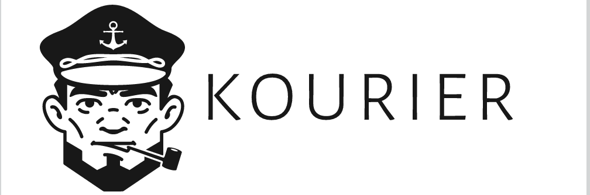

<!-- PROJECT SHIELDS -->
[![Contributors][contributors-shield]][contributors-url]
[![Forks][forks-shield]][forks-url]
[![Stargazers][stars-shield]][stars-url]
[![Issues][issues-shield]][issues-url]
[![MIT License][license-shield]][license-url]

<!-- in further:
https://shields.io/category/build

 -->

<p align="center">
    
  <p align="center">
    Kubernetes-based automation manager framework
    <br />
    <a href="https://github.com/kourier-io/kourier/issues">Report Bug</a>
    ·
    <a href="https://github.com/kourier-io/kourier/issues">Request Feature</a>
  </p>
</p>


<!-- TABLE OF CONTENTS -->
## Table of Contents

* [About the Project](#about-the-project)
  * [What is it](#what-is-it)
  * [Features](#features)
* [Getting Started](#getting-started)
  * [Prerequisites](#prerequisites)
  * [Installation](#installation)
* [Examples](#examples)
* [Roadmap](#roadmap)
* [Contributing](#contributing)
* [License](#license)
* [Contacts](#contacts)
* [Acknowledgements](#acknowledgements)


## About The Project

### What is it
There are a massive amount of tools in the world of DevOps. Simple and complex ones. They are designed to solve, and we have to use a lot of them to achieve our goals. But there is one problem. The problem beyond them - they don't know about each other (most of them).

This project allows us to connect varous environments using handles they provide. We do it by using specified controllers and describing event flows in kubernetes [CRDs](https://kubernetes.io/docs/concepts/extend-kubernetes/api-extension/custom-resources/). Think about it as IFTTT for internal infrastructure.

Usecase sample: send a notification to custom chat messenger and create an annotation in grafana on successful CI build. See [examples](#examples) and [architecture concept](doc/architecture.md) for more information.

NOTE: this is ALPHA version of Kourier service mesh. After testing the concept implementation and protocol, we can change with backward compatibility.

### Features
- native CloudEvents support
- infrastructure as a code
- automatic validation and normalization with json schemas
- ability to create languange-agnostic controllers
- extending pipelines using jsonnet language
- ... see Roadmap

## Getting Started

### Installation
 
```sh
# add helm chart repository
helm repo add kourier https://kourier-io.github.io/helm-chart

# create default custom resource definitions
helm upgrade kourier-crd kourier/crd --install

# install basic wersion of webhook controller
# available options: https://github.com/kourier-io/helm-chart/blob/master/kourier/values.yaml
helm upgrade kourier-rest kourier/kourier --install --set controllerName=rest,service.enabled=true,image.repository=kourier/rest-controller
```


## Examples

### Basic
This is simple demonstration how to trigger remote system using event from custom webhook.
```sh
# apply webhook config
kubectl apply -f https://raw.githubusercontent.com/kourier-io/kourier/master/examples/basic/webhook.yml
# apply webhook event catcher
kubectl apply -f https://raw.githubusercontent.com/kourier-io/kourier/master/examples/basic/request.yml
# forward rest controller port
kubectl port-forward service/kourier-rest 8080
# point your browser to https://kourier.requestcatcher.com/ and execute:
curl -X POST "http://localhost:8080/test" -H "Content-Type: application/json" \
 -d '{
  "message": "hello"
 }'
```

### Advanced
TBD

### Writing controller
TBD

## Roadmap

See the [open issues](https://github.com/kourier-io/kourier/labels/enhancement) for a list of proposed features


## Contributing

Contributions are what make the open source community such an amazing place to be learn, inspire, and create. Any contributions you make are **greatly appreciated**.

1. Fork the Project
2. Create your Feature Branch (`git checkout -b feature/AmazingFeature`)
3. Commit your Changes (`git commit -m 'Add some AmazingFeature'`)
4. Push to the Branch (`git push origin feature/AmazingFeature`)
5. Open a Pull Request


## License

Distributed under the MIT License. See `LICENSE` for more information.


## Acknowledgements
Autors:
* [https://makeomatic.ca](https://makeomatic.ca/)

Inspired by:
* [https://stackstorm.com/](https://stackstorm.com/)
* [https://github.com/argoproj/argo-events](https://github.com/argoproj/argo-events)

Uses:
* [https://jsonnet.org/](https://jsonnet.org/)
* [https://cloudevents.io/](https://cloudevents.io/)
* [https://json-schema.org/](https://json-schema.org/)


[contributors-shield]: https://img.shields.io/github/contributors/kourier-io/kourier.svg?style=flat-square
[contributors-url]: https://github.com/kourier-io/kourier/graphs/contributors
[forks-shield]: https://img.shields.io/github/forks/kourier-io/kourier.svg?style=flat-square
[forks-url]: https://github.com/kourier-io/kourier/network/members
[stars-shield]: https://img.shields.io/github/stars/kourier-io/kourier.svg?style=flat-square
[stars-url]: https://github.com/kourier-io/kourier/stargazers
[issues-shield]: https://img.shields.io/github/issues/kourier-io/kourier.svg?style=flat-square
[issues-url]: https://github.com/kourier-io/kourier/issues
[license-shield]: https://img.shields.io/github/license/kourier-io/kourier.svg?style=flat-square
[license-url]: https://github.com/kourier-io/kourier/blob/master/LICENSE
